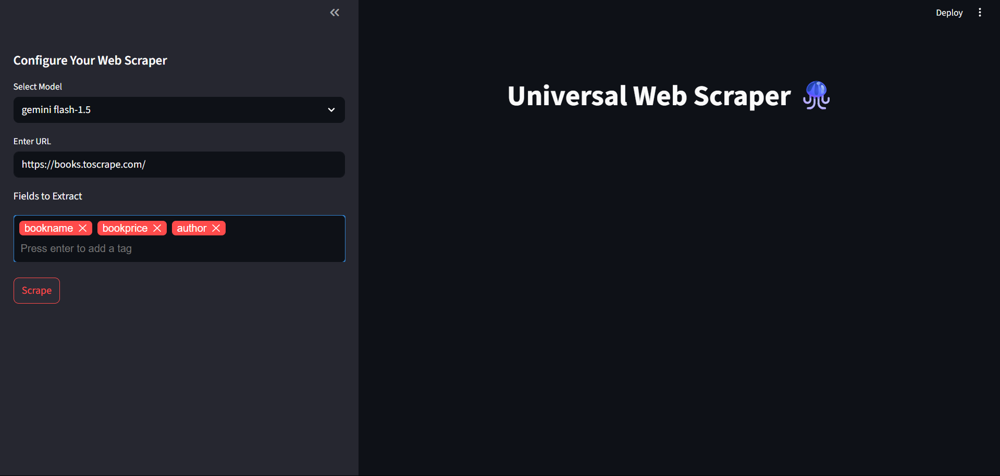
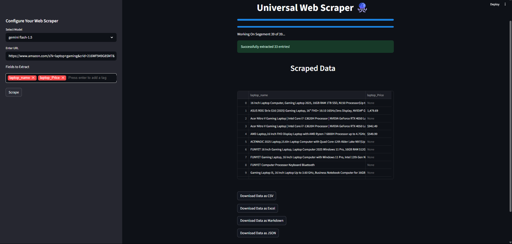

# 🌐 Universal Web Scraper — Streamlit + Gemini AI

A **no‑code, AI‑enhanced** web scraping tool built with **Streamlit**, **Selenium**, and **Google Gemini Flash 1.5**. Easily extract structured data from paginated web pages by specifying just the fields you want — no selectors, no HTML parsing, no coding.

---

## 🚀 Features

- ✅ **Streamlit UI**: Paste a URL and specify fields — zero code needed  
- 🔄 **Automatic pagination** using Selenium  
- 🧠 **AI‑assisted data extraction** with Google Gemini 1.5 Flash  
- 🧹 Converts HTML → Markdown → structured JSON  
- 📤 Export as **CSV**, **Excel**, **Markdown**, or **JSON**  
- 📊 Real‑time token usage and Gemini cost tracking  
- 💾 Save raw markdown and Gemini responses  

---

## 🗂️ Project Structure
```
📦 your-repo/
│
├── ui.py                         # 🎛️ Streamlit user interface
├── Markdowncnvrtr.py             # 🔄 HTML to Markdown converter
├── Dynamic.py                    # 🧱 Dynamic field validation
├── scraper.py                    # 🧠 Scraping + Gemini logic
├── requirements.txt              # 📦 Required dependencies
├── .env                          # 🔐 Environment variables (GOOGLE_API_KEY)
└── output/
    ├── MarkdownFiles/            # 📝 Saved markdown from pages
    └── FormattedFiles/           # 💡 Extracted data in JSON
```

---

## 🖼️ App Screenshots

### 🏠 Streamlit UI – Homepage  
> _Paste a URL, type your fields, and press “Scrape”._

 

---


### 📊 AI Output & Download  
> _Download your data in multiple formats._



---

## ⚙️ Setup Instructions

```bash
# 1. Clone the repository
git clone https://github.com/<your-username>/<repo-name>.git
cd <repo-name>

# 2. Create a virtual environment
python -m venv venv
source venv/bin/activate      # Windows: venv\Scriptsctivate

# 3. Install required packages
pip install -r requirements.txt

# 4. Add your Google API key (Make a .env file if it it is not available )
echo "GOOGLE_API_KEY=your_api_key" > .env

# 5. Run the app
streamlit run Task8pt1_ui.py
```
# make sure you create your api key #
---

## 🧠 How It Works

1. Loads all paginated pages using **Selenium** (`li.next > a`)  
2. Converts HTML → Markdown using `html2text`  
3. Chunks long text (~16 k tokens each) for Gemini 1.5  
4. Gemini receives your field list + raw text, returns structured JSON  
5. Results are validated and saved/exported  

---

## ✨ Gemini Prompt (System Message)

```
You are an intelligent text extraction and conversion assistant.
Your task is to extract structured information from the given text 
and convert it into a pure JSON format...
```

---

## 🧪 Sample Python Usage (Without Streamlit)

```python
from scraper import scraping_function

url = "https://books.toscrape.com"
fields = ["title", "price", "rating"]
model = "gemini flash-1.5"

df, input_tokens, output_tokens, cost = scraping_function(url, fields, model)
df.to_csv("books.csv", index=False)
```

---

## 🔐 Environment Variables

| Variable         | Required | Description                       |
|------------------|----------|-----------------------------------|
| `GOOGLE_API_KEY` | ✅       | Your API key for Google Gemini AI |

---

## 📦 Dependencies

See `requirements.txt` for full versions. Major packages used:

- `streamlit`, `selenium`, `webdriver-manager`, `html2text`, `google-generativeai`, `pandas`, `pydantic`, `python-dotenv`

---

## 🛠️ Future Improvements

- [ ] OpenAI GPT‑4o support  
- [ ] Playwright fallback for scraping  
- [ ] Docker support  
- [ ] Retry mechanism for Gemini timeouts  

---

## 📄 License

This project is licensed under the MIT License — see the `LICENSE` file for details.

---

## 🙏 Acknowledgments

- [Streamlit](https://streamlit.io/)  
- [Google Gemini](https://ai.google.dev/)  
- [Books to Scrape](https://books.toscrape.com) — test site  
- [webdriver-manager](https://github.com/SergeyPirogov/webdriver_manager)  
